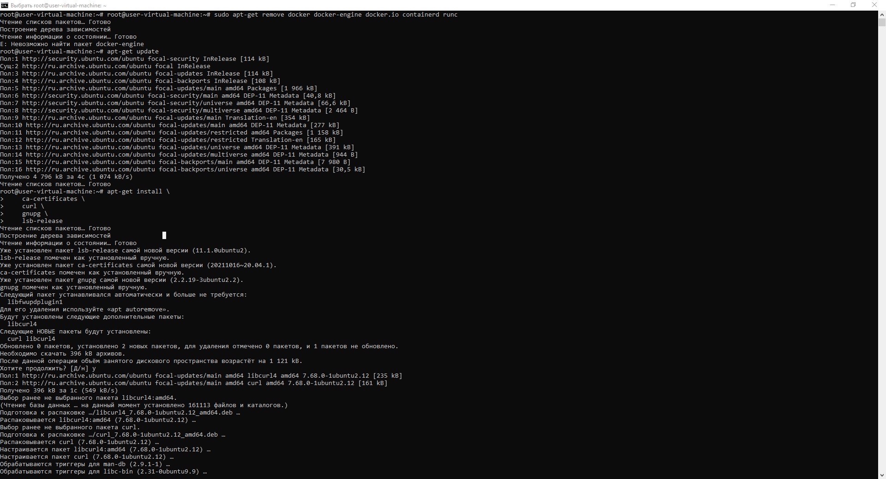
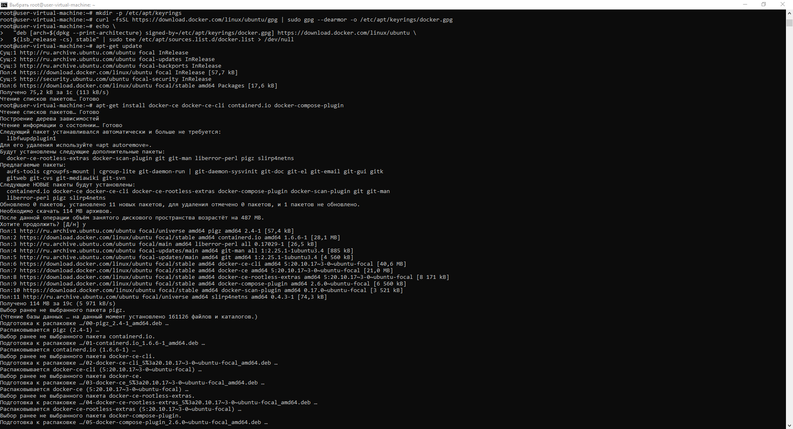
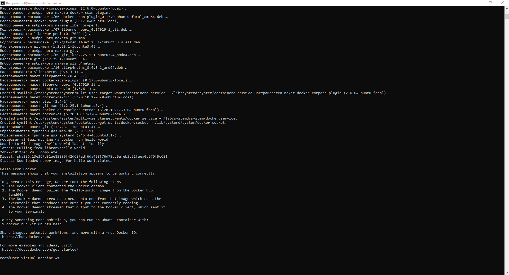
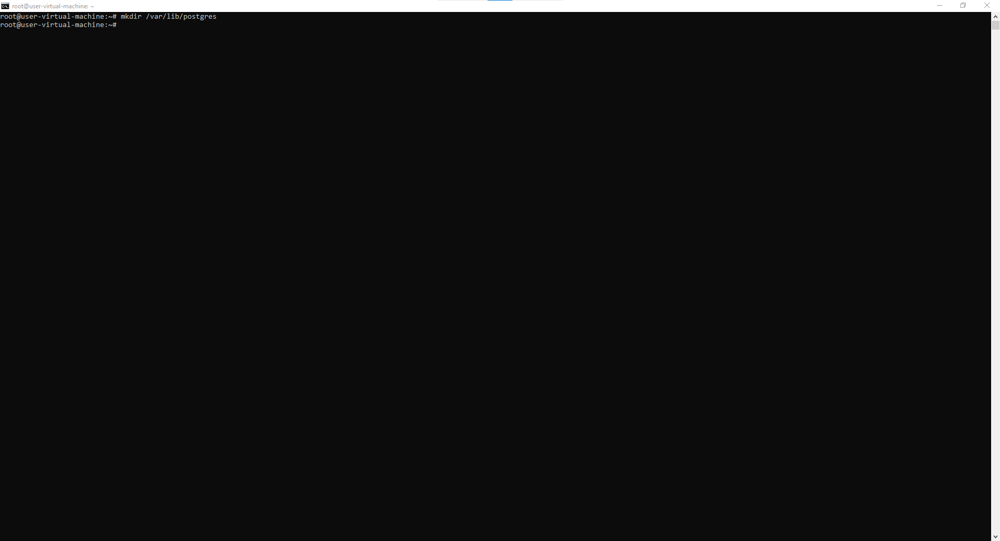

# Установка и настройка PostgteSQL в контейнере Docker
## Установка Docker Engine
Установка Docker Engine согласно оф. документации:
1. sudo apt-get remove docker docker-engine docker.io containerd runc
2. sudo apt-get update 
3. apt-get install \    ca-certificates \    curl \    gnupg \    lsb-release
4. sudo mkdir -p /etc/apt/keyrings
5. curl -fsSL https://download.docker.com/linux/ubuntu/gpg | sudo gpg --dearmor -o /etc/apt/keyrings/docker.gpg
6.echo \ "deb [arch=$(dpkg --print-architecture) signed-by=/etc/apt/keyrings/docker.gpg] https://download.docker.com/linux/ubuntu \
  $(lsb_release -cs) stable" | sudo tee /etc/apt/sources.list.d/docker.list > /dev/null

## сделать каталог /var/lib/postgres

